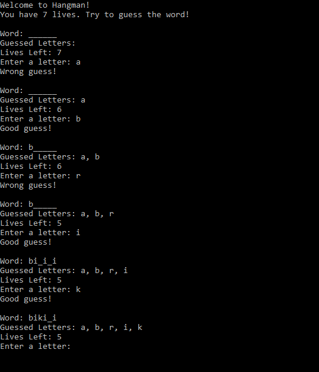

# Hangman Game

Welcome to the Hangman Game! This is a simple console-based word-guessing game written in C#.

## Features
- Randomly selected words for each game session.
- Guess letters to reveal the hidden word.
- A limited number of lives to make the game challenging.
- Option to replay or exit after each game.

## How to Run
1. Download the `HangmanGame.exe` from the repository.
2. Double-click the executable file to start the game.
3. Follow the on-screen instructions to play.

## Requirements
- Windows OS (tested on Windows 10/11).
- [.NET Runtime](https://dotnet.microsoft.com/download) installed on your machine.

## How to Play
1. Guess one letter at a time by typing it in the console.
2. If the letter is in the word, it will be revealed in the correct position(s).
3. If the letter is not in the word, you lose a life.
4. The game ends when you either guess the word correctly or run out of lives.

## Screenshot

